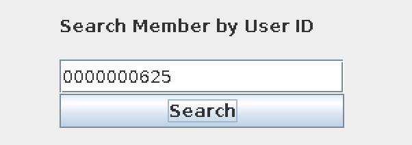
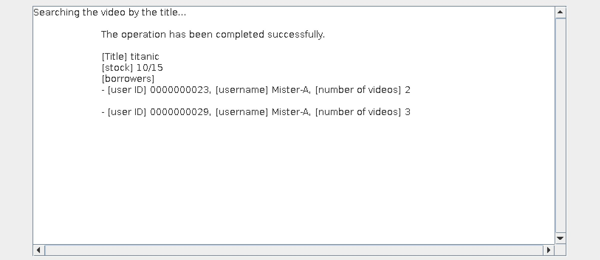
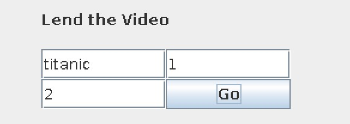
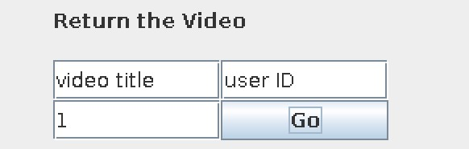
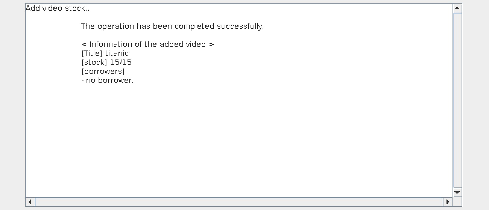
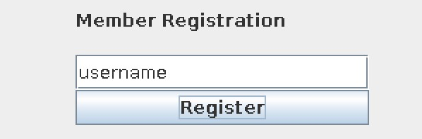

# プログラミング第2 最終課題レポート

## GUI外観


## 使用方法の説明
- プログラムは`RentalVideoSystem.java`と`lib/`下のファイル群から構成され、
  `RentalVideoSystem.java`内部の`main`関数が主体となって動作する。  
- 基本的に、GUI上部の9つのクエリを利用してレンタルビデオシステムに対して操作を行い、
  その結果をGUI下部のテキストフィールドで表示するように設計されている。ここから各クエリの説明を行う。

### Search Member by UserName
登録された会員を会員名で検索し、情報を列挙する。検索は全文一致のみをサポートし、複数の会員が
一致していればそれら全ての情報を列挙する。(会員登録の際にそれぞれに固有の会員番号が割り振られる
ため、会員名の重複は許している。)  
また、不正な入力に対して例外処理を通して簡単なフィードバックを行う。
- **クエリフィールド外観**  
  
- **動作例**  
  - まず何も入力せずテキストボックスに"username"と表示されたままボタンを押下すると、次の画像に示すような
    エラーメッセージ、ヒントを返す。(少しヘンな文になってるのはご愛嬌ということに..)  
    
  - テキストボックスに"username"以外の何らかの文字列を入力すると、それを会員名とする会員を全員列挙する。
    ここで、会員名が同じ会員が複数いても良い。なぜなら、会員登録の際にそれぞれに固有の会員番号が割り振られるからである。
    次に示す図は会員名が"a"である会員が複数人登録されている場合にボタンを押下した出力である。  
      
    図を見ると分かるように、検索に一致した会員の情報が列挙されており、それぞれの会員の情報として、会員名、会員番号、
    さらに現在借りているビデオのタイトルとそのビデオの本数が列挙される。  
  - さらに存在しない会員番号を入力した場合、次の画像のようにフィードバックを行う。  
      
      

### Search Member by User ID
登録された会員を会員番号で検索し、情報を表示する。ここで会員番号は各会員に1対1対応するため、検索した会員番号に
一致する会員は一人に定まる。  
また、不正な入力に対して例外処理を通して簡単なフィードバックを行う。
- **クエリフィールド外観**  
  
- **動作例**  
  - まず何も入力せずテキストボックスに"username"と表示されたままボタンを押下すると、次の画像に示すような
    エラーメッセージ、ヒントを返す。  
      
  - テキストボックスに整数以外が入力された場合、次の画像のようなエラーメッセージ、ヒントを返す。  
      
      
  - テキストボックスに整数が入力された場合、次の画像のように検索に一致した会員の情報を表示する。  
      
      
    図を見ると分かるように、検索に一致した会員の情報が列挙されており、それぞれの会員の情報として、会員名、会員番号、
    さらに現在借りているビデオのタイトルとそのビデオの本数が列挙される。  
  - また、この時会員番号の入力方法として上記のように整数を入力しても良いが、以下のように10桁の会員番号の形で
    入力しても良い。  
      
      
  - さらに存在しない会員番号を入力した場合、次の画像のように原因、ヒント、提案を提示する。  
      
      
  - なお、IDは内部的にはint型なので、先頭の桁によってはオーバーフローし、上述の整数型へのパースに失敗するパターン
    と同じ挙動を示す。  

### Search Video by Title
システムが管理しているビデオをタイトルで検索し、情報を列挙する。検索は全文一致のみをサポートし、
不正な入力に対して例外処理を通して簡単なフィードバックを行う。  
- **クエリフィールド外観**  
    
- **動作例**  
  - まず何も入力せずテキストボックスに"video title"と表示されたままボタンを押下すると、次の画像に示すような
    エラーメッセージ、ヒントを返す。  
      
  - テキストボックスに"video title"以外の何らかの文字列を入力すると、それをタイトルとするビデオを検索する。
    次に示す図は"titanic"を検索した例である。
      
      
  - さらに存在しないタイトルを入力した場合、次の画像に示すようなエラーメッセージ、ヒントを返す。  
      
      

### Lend the Video
貸し出しを行う。左上の欄にビデオタイトル、右上の欄に会員番号、左下の欄に貸し出したいビデオの本数を
入力して操作する。また、不正な入力に対して例外処理を通して簡単なフィードバックを行う。  
- **クエリフィールド外観**  
    
- **動作例**  
  - まず何も入力せずテキストボックスデフォルト表示のままボタンを押下すると、次の画像に示すような
    エラーメッセージ、ヒントを返す。  
      
  - 様々なケースがあるのでここで例示はしないが、入力の不正はエラー処理されてフィードバックが行われる。
  - 入力に不正がなく、存在するビデオのタイトル、存在する会員番号、貸し出しが成立するビデオ本数が指定
    された場合は次の画像のように処理後の状態を表示する。  
      
      
  - 入力に不正がないが、貸し出し本数の問題などで正常に貸し出しが成立しない場合は次の画像のようにフィードバックを返す。  
      
      

### Return the Video
返却を管理する。左上の欄にビデオタイトル、右上の欄に会員番号、左下の欄に貸し出したいビデオの本数を
入力して操作する。また、不正な入力に対して例外処理を通して簡単なフィードバックを行う。  
- **クエリフィールド外観**  
    
- **動作例**  
  - まず何も入力せずテキストボックスデフォルト表示のままボタンを押下すると、これまでの機能と同様に
    エラーメッセージ、ヒントを返す。  
  - 様々なケースがあるのでここで例示はしないが、入力の不正はエラー処理されてフィードバックが行われる。  
  - 入力に不正がなく、存在するビデオのタイトル、ビデオを該当するビデオを借りている会員の会員
    番号、返却が成立するビデオ本数が指定された場合は次の画像のように処理後の状態を表示する。  
      
      
  - 入力に不正がないが、返却本数の問題などで正常に貸し出しが成立しない場合は次の画像のようにフィードバックを返す。  
      
      

### Add the Video Stock
ビデオ在庫の追加を行う。左の欄にビデオタイトル、右の欄に追加する本数を入力して操作する。また、
不正な入力に対して例外処理を通して簡単なフィードバックを行う。  
- **クエリフィールド外観**  
    
- **動作例** 
  - まず何も入力せずテキストボックスデフォルト表示のままボタンを押下すると、これまでの機能と同様に
    エラーメッセージ、ヒントを返す。  
  - 様々なケースがあるのでここで例示はしないが、入力の不正はエラー処理されてフィードバックが行われる。  
  - 入力に不正がなく、存在するビデオのタイトル、在庫の追加が成立するビデオ本数が指定された場合は次の
    画像のように処理後の状態を表示する。  
      
      
  - 入力に不正がないが、負の本数を与えられるなどの問題で正常に在庫の追加が成立しない場合は次の画像
    のようにフィードバックを返す。  
      
      

### Reduce the Video Stock
ビデオ在庫の削減を行う。左の欄にビデオタイトル、右の欄に減らす本数を入力して操作する。また、
不正な入力に対して例外処理を通して簡単なフィードバックを行う。  
- **クエリフィールド外観**  
    
- **動作例** 
  - まず何も入力せずテキストボックスデフォルト表示のままボタンを押下すると、これまでの機能と同様に
    エラーメッセージ、ヒントを返す。  
  - 様々なケースがあるのでここで例示はしないが、入力の不正はエラー処理されてフィードバックが行われる。  
  - 入力に不正がなく、存在するビデオのタイトル、在庫の削減が成立するビデオ本数が指定された場合は次の
    画像のように処理後の状態を表示する。  
      
      
  - 入力に不正がないが、手元にある在庫量以上の本数が与えられるなどの問題で正常に在庫の削減が成立しない場合は次の画像
    のようにフィードバックを返す。  
      
      

### Member Registration
新たに会員の登録を行う。会員名を入力して操作する。この時会員番号は自動的に固有の番号が割り当てられ、
また不正な入力に対して例外処理を通して簡単なフィードバックを行う。  
- **クエリフィールド外観**  
    
- **動作例** 
  - まず何も入力せずテキストボックスデフォルト表示のままボタンを押下すると、これまでの機能と同様に
    エラーメッセージ、ヒントを返す。  
  - 登録が成立すると、次の画像のように登録時の情報を表示する。  
      
      

### Member Withdrawal
会員の退会手続きを行う。会員番号を入力して操作する。また不正な入力に対して例外処理を通して簡単なフィードバックを行う。  
- **クエリフィールド外観**  
    
- **動作例** 
  - まず何も入力せずテキストボックスデフォルト表示のままボタンを押下すると、これまでの機能と同様に
    エラーメッセージ、ヒントを返す。  
  - 存在しない会員番号を入力するなどの入力の不正はエラー処理されてフィードバックが行われる。  
  - 退会が成立すると、次の画像のようにフィードバックを行う。  
      
      
  - 会員がまだ返却していないビデオが存在する場合は退会が成立せず、次の画像のようにフィードバックを返す。  
      
      

## 設計の説明
以降のページにドキュメンテーションとして各クラスの説明を行う。

### ディレクトリ構成
各クラスの説明に移る前にディレクトリ構成を簡単に図示しておく。
```plane
ProjectRoot/
    +- RentalVideoSystem.java
    +- lib/
        +- util/
            +- Pair.java
            +- exception/
                +- ExistenceException.java
                +- ForbiddenActionException.java
        +- rental_video_member/
            +- RentalVideoMember.java
            +- MembersList.java
        +- video/
            +- Video.java
            +- VideoArchive.java
        +- gui/
            +- AddVideoStockField.java
            +- ReduceVideoStockField.java
            +- RegisterMemberField.java
            +- MemberWithdrawalField.java
            +- LendVideoField.java
            +- ReturnVideoField.java
            +- SearchMemberByIdField.java
            +- SearchMemberByNameField.java
            +- SearchVideoByNameField.java
```
